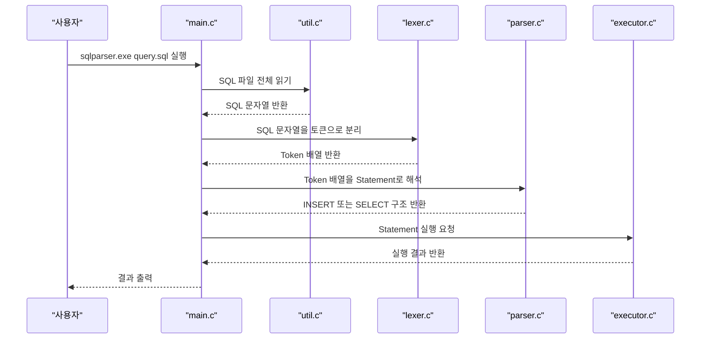
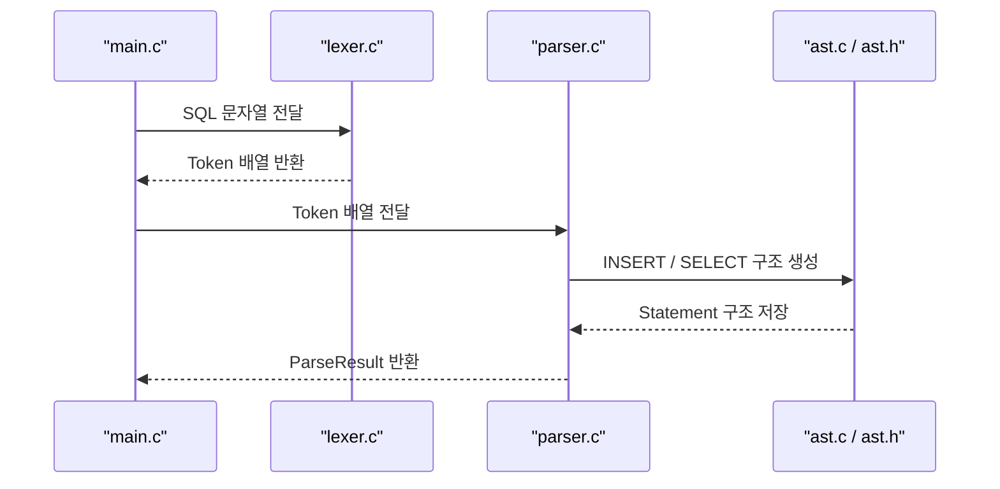
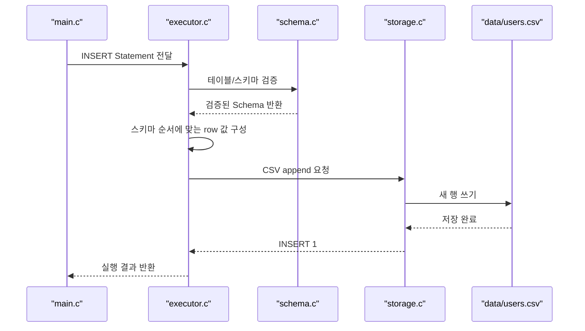
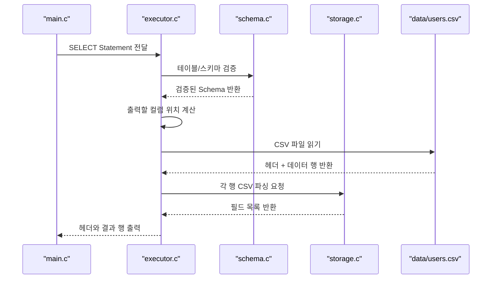
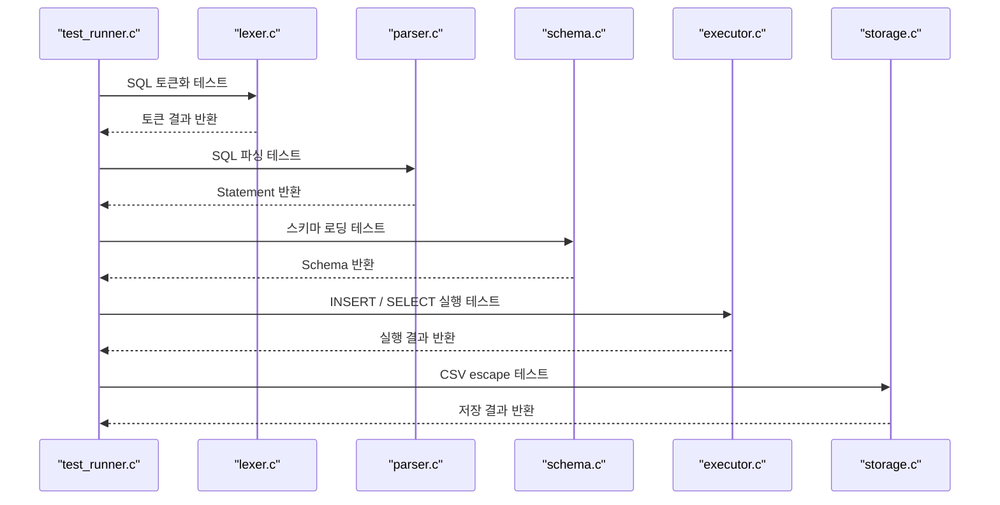

# 파일별 코드 설명서

이 문서는 이 프로젝트를 처음 읽는 사람이 `어떤 파일이 무슨 역할을 하는지`, `어떤 순서로 읽으면 이해하기 쉬운지`를 빠르게 파악할 수 있도록 만든 안내서입니다.

코드 한 줄 한 줄의 의미는 소스 파일 안 주석을 보면 되고, 이 문서는 그보다 한 단계 위에서 `파일 단위 역할`과 `데이터 흐름`을 설명합니다.

## 1. 먼저 어떻게 읽으면 좋은가

처음 읽을 때는 아래 순서를 추천합니다.

1. `src/main.c`
프로그램이 어디서 시작되는지 봅니다.

2. `src/lexer.c` / `src/parser.c`
SQL 문장이 어떻게 구조로 바뀌는지 봅니다.

3. `src/executor.c`
구조화된 SQL이 실제 동작으로 어떻게 연결되는지 봅니다.

4. `src/schema.c` / `src/storage.c`
테이블 규칙과 CSV 저장 규칙을 봅니다.

5. `tests/test_runner.c`
무엇을 검증했는지 확인합니다.

## 2. 프로젝트 전체 흐름

이 프로젝트의 핵심 흐름은 아래와 같습니다.

`SQL 파일 읽기 -> 토큰 분리 -> 문장 해석 -> 실행 -> CSV 저장/조회`

### 시퀀스 다이어그램 1: 전체 실행 흐름



## 3. 파일별 역할 설명

### 3-1. 시작과 공통 도구

#### `src/main.c`

이 파일은 프로그램의 시작점입니다.

- 명령행 인자를 확인합니다.
- SQL 파일을 읽습니다.
- lexer를 호출합니다.
- parser를 호출합니다.
- executor를 호출합니다.
- 마지막 결과를 출력합니다.

즉, 전체 흐름을 연결하는 `지휘자` 역할입니다.

#### `src/util.h`

여러 파일에서 공통으로 쓰는 함수와 자료구조 선언이 들어 있습니다.

- `StringList`
- 파일 전체 읽기 함수
- 문자열 복사 함수
- 공백 제거 함수
- 경로 생성 함수

#### `src/util.c`

`util.h` 에 선언된 공통 함수들의 실제 구현입니다.

- `read_entire_file`
파일 내용을 한 번에 문자열로 읽습니다.
- `copy_string`
문자열 복사본을 만듭니다.
- `trim_whitespace`
문자열 앞뒤 공백을 제거합니다.
- `string_list_push`
문자열 리스트에 값을 추가합니다.
- `build_path`
`schema/users.meta` 같은 경로를 만듭니다.

이 파일은 프로젝트 전체의 `기초 공구함` 역할입니다.

### 3-2. SQL를 해석하는 부분

#### `src/lexer.h`

토큰 종류와 토큰 배열 구조를 선언합니다.

- `TOKEN_IDENTIFIER`
- `TOKEN_STRING`
- `TOKEN_NUMBER`
- `TOKEN_COMMA`
- `TOKEN_LPAREN`
- `TOKEN_RPAREN`
- `TOKEN_SEMICOLON`

#### `src/lexer.c`

SQL 문자열을 작은 조각(Token)으로 나눕니다.

예를 들어 아래 SQL이 있으면

```sql
INSERT INTO users (id, name) VALUES (1, 'Alice');
```

대략 이런 조각들로 나눕니다.

- `INSERT`
- `INTO`
- `users`
- `(`
- `id`
- `,`
- `name`
- `)`
- `VALUES`
- `(`
- `1`
- `,`
- `Alice`
- `)`
- `;`

즉, lexer는 문장을 바로 이해하지는 않고 `읽기 쉬운 조각`으로 먼저 자르는 역할입니다.

### 시퀀스 다이어그램 2: SQL 파싱 전반



#### `src/parser.h`

parser가 반환하는 `ParseResult` 구조를 선언합니다.

- 파싱 성공 여부
- 해석된 문장 구조
- 실패 메시지

#### `src/parser.c`

lexer가 만든 토큰 배열을 읽어 실제 SQL 의미로 해석합니다.

현재는 아래 두 문장만 지원합니다.

- `INSERT`
- `SELECT`

이 파일이 하는 일은 아래와 같습니다.

- 첫 토큰이 `INSERT` 인지 `SELECT` 인지 판단
- 테이블명 읽기
- 컬럼 목록 읽기
- 값 목록 읽기
- 세미콜론 검사
- 최종적으로 `Statement` 구조체 생성

즉, parser는 “이 문장이 무슨 뜻인지”를 이해하는 역할입니다.

#### `src/ast.h`

파싱 결과를 담는 구조체를 선언합니다.

- `InsertStatement`
- `SelectStatement`
- `Statement`

#### `src/ast.c`

AST 구조체 내부에서 동적으로 만든 메모리를 해제합니다.

이 파일의 역할은 작지만 중요합니다.  
문자열과 리스트를 많이 만들기 때문에, 마지막에 안전하게 정리하는 코드가 필요합니다.

### 3-3. 실행하는 부분

#### `src/executor.h`

실행 결과 구조체 `ExecResult` 와 실행 함수 선언이 들어 있습니다.

#### `src/executor.c`

parser가 만든 `Statement` 를 실제 동작으로 바꾸는 핵심 파일입니다.

이 파일은 두 갈래로 나뉩니다.

- `INSERT` 실행
- `SELECT` 실행

`INSERT`에서는

- 스키마 검증
- 컬럼 수 검증
- 부분 컬럼 INSERT 처리
- CSV 한 줄 추가

를 수행합니다.

`SELECT`에서는

- 스키마 검증
- 선택 컬럼 위치 계산
- CSV 파일 읽기
- 헤더 출력
- 데이터 행 출력

를 수행합니다.

즉, 이 파일은 이 프로젝트의 `실질적인 처리기 핵심` 입니다.

### 시퀀스 다이어그램 3: INSERT 실행 흐름



### 시퀀스 다이어그램 4: SELECT 실행 흐름



### 3-4. 테이블 규칙과 저장 규칙

#### `src/schema.h`

스키마 구조체와 스키마 로딩 결과 구조체를 선언합니다.

#### `src/schema.c`

테이블이 “정상적으로 존재하는지”를 검사하는 파일입니다.

현재 규칙은 아래와 같습니다.

- `schema/<table>.meta` 파일이 있어야 함
- `data/<table>.csv` 파일이 있어야 함
- CSV 첫 줄 헤더가 meta 파일 컬럼 순서와 같아야 함

즉, schema.c는 테이블 구조의 `신뢰성 검사기` 역할입니다.

#### `src/storage.h`

CSV 처리 관련 함수와 저장 결과 구조체를 선언합니다.

#### `src/storage.c`

CSV 관련 실제 처리를 담당합니다.

주요 역할은 아래와 같습니다.

- CSV 한 줄 파싱
- 문자열 CSV escape
- CSV 파일 끝에 새 행 추가

예를 들어 문자열 안에 쉼표나 큰따옴표가 있으면 CSV 규칙에 맞게 아래처럼 바꿉니다.

- 원본: `hello, "world"`
- 저장: `"hello, ""world"""`

즉, storage.c는 파일 저장 형식의 `세부 규칙 담당` 입니다.

## 4. 테스트 파일 설명

#### `tests/test_runner.c`

이 파일은 자동 테스트를 모아 둔 실행 파일입니다.

테스트 항목은 크게 아래 다섯 종류입니다.

- lexer 테스트
- parser 테스트
- schema 테스트
- INSERT 실행 테스트
- SELECT 실행 테스트
- CSV escape 테스트

이 파일을 보면 “우리가 무엇을 중요하게 검증했는지”를 바로 알 수 있습니다.

### 시퀀스 다이어그램 5: 테스트 실행 흐름



## 5. 폴더별 역할

### `schema/`

테이블 구조를 설명하는 meta 파일이 들어 있습니다.

예:

- `schema/users.meta`

### `data/`

실제 데이터가 저장되는 CSV 파일이 들어 있습니다.

예:

- `data/users.csv`

### `examples/`

발표나 데모 때 바로 실행할 수 있는 예제 SQL 파일이 들어 있습니다.

예:

- `examples/insert_users.sql`
- `examples/select_name_age.sql`
- `examples/select_all_users.sql`

## 6. 발표 때 어떻게 설명하면 좋은가

발표에서는 모든 파일을 다 자세히 설명하기보다 아래 흐름으로 설명하는 것이 좋습니다.

1. `main.c`
프로그램이 어디서 시작되는지 설명

2. `lexer.c` 와 `parser.c`
SQL 문장을 어떻게 이해하는지 설명

3. `executor.c`
파싱된 결과가 실제 CSV 저장/조회로 어떻게 이어지는지 설명

4. `schema.c` 와 `storage.c`
왜 파일 기반 DB가 안정적으로 동작하는지 설명

5. `test_runner.c`
우리가 어떻게 검증했는지 설명

## 7. 한 줄 요약

이 프로젝트에서 파일들의 역할은 아래처럼 정리할 수 있습니다.

- `main.c`: 전체 흐름 시작
- `lexer.c`: SQL를 조각으로 자름
- `parser.c`: 조각들을 문장 구조로 해석
- `ast.c`: 해석 결과 메모리 관리
- `executor.c`: 실제 실행
- `schema.c`: 테이블 구조 검증
- `storage.c`: CSV 규칙 처리
- `test_runner.c`: 전체 기능 검증

즉, 이 프로젝트는 `읽기 -> 해석 -> 실행 -> 저장 -> 검증` 구조로 나뉘어 있습니다.
