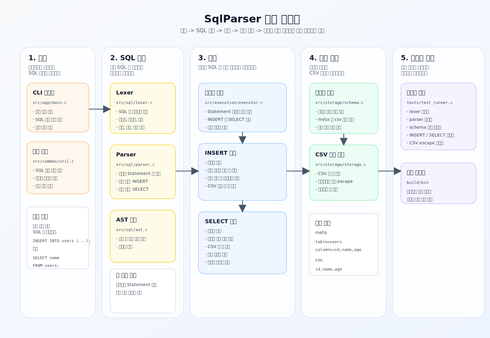

# SqlParser

C 언어로 구현한 파일 기반 SQL 처리기입니다.  
텍스트 파일로 전달된 SQL을 읽고, `INSERT` 와 `SELECT` 를 파싱한 뒤, CSV 파일 기반 테이블에 대해 실제 저장과 조회를 수행합니다.

## 핵심 문서

- 구현 계획서 PDF: [docs/sql_processor_plan.pdf](./docs/sql_processor_plan.pdf)
- 구현 계획서 HTML: [docs/sql_processor_plan.html](./docs/sql_processor_plan.html)
- 상세 파일 가이드 원본: [docs/CODE_GUIDE.md](./docs/CODE_GUIDE.md)

## 현재 지원 기능

- `INSERT INTO table_name (col1, col2, ...) VALUES (val1, val2, ...);`
- `SELECT * FROM table_name;`
- `SELECT col1, col2 FROM table_name;`

현재 버전에서는 아래 기능은 제외했습니다.

- `WHERE`
- `JOIN`
- `UPDATE`
- `DELETE`
- `CREATE TABLE`

## 한눈에 보는 기능 구조

아래 이미지는 이 프로젝트를 기능별로 나눠 보여주는 구조도입니다.  
어느 파일이 입력을 받고, 어디서 SQL 을 해석하고, 어떤 모듈이 CSV 저장과 조회를 담당하는지 한눈에 볼 수 있습니다.



핵심 흐름은 아래 한 줄로 요약할 수 있습니다.

`SQL 파일 읽기 -> 토큰 분리 -> 문장 해석 -> 실행 -> CSV 저장/조회 -> 테스트 검증`

## 처음 읽는 순서

프로젝트를 처음 볼 때는 아래 순서로 읽으면 전체 구조를 빠르게 파악할 수 있습니다.

1. `src/app/main.c`
2. `src/sql/lexer.c`
3. `src/sql/parser.c`
4. `src/execution/executor.c`
5. `src/storage/schema.c`
6. `src/storage/storage.c`
7. `tests/test_runner.c`

이 순서대로 보면 `입력 -> 해석 -> 실행 -> 저장 -> 검증` 흐름이 자연스럽게 이어집니다.

## 확장성을 고려한 디렉터리 구조

```txt
.
├── build/
│   ├── bin/
│   └── tests/
├── data/
├── docs/
├── examples/
├── include/
│   └── sqlparser/
│       ├── common/
│       ├── execution/
│       ├── sql/
│       └── storage/
├── schema/
├── src/
│   ├── app/
│   ├── common/
│   ├── execution/
│   ├── sql/
│   └── storage/
├── tests/
├── .gitignore
└── Makefile
```

### 구조를 이렇게 나눈 이유

- `include/sqlparser/...`
  외부에서 읽는 공개 헤더를 역할별로 분리합니다.
- `src/app`
  프로그램 시작점과 CLI 진입점을 둡니다.
- `src/sql`
  SQL 해석 관련 코드만 모읍니다.
- `src/storage`
  파일 저장과 스키마 검증 코드를 모읍니다.
- `src/execution`
  파싱된 결과를 실제 동작으로 연결하는 실행기를 둡니다.
- `src/common`
  여러 모듈에서 공통으로 쓰는 유틸을 둡니다.
- `docs`
  README 외 별도 설명 문서를 보관합니다.
- `build`
  실행 파일과 테스트 임시 파일을 분리해 작업 폴더를 깔끔하게 유지합니다.

이렇게 나누면 앞으로 `WHERE`, `UPDATE`, 직접 SQL 입력 옵션, 로그 기능 같은 확장을 할 때 기존 구조를 크게 흔들지 않고 파일을 추가할 수 있습니다.

## 디렉터리와 파일별 역할

### `src/app/main.c`

프로그램의 시작점입니다.

- 명령행 인자 확인
- SQL 파일 읽기
- lexer 호출
- parser 호출
- executor 호출
- 결과 출력

즉, 전체 흐름을 연결하는 지휘자 역할입니다.

### `src/common/util.c`

프로젝트 전체에서 공통으로 쓰는 기초 함수들을 모아 둔 파일입니다.

- 파일 전체 읽기
- 문자열 복사
- 공백 제거
- 문자열 리스트 관리
- 경로 문자열 생성

### `src/sql/lexer.c`

SQL 문자열을 토큰 단위로 나눕니다.

- 식별자
- 문자열
- 숫자
- 쉼표
- 괄호
- 세미콜론

즉, 문장을 바로 이해하지 않고 먼저 읽기 쉬운 조각으로 자르는 단계입니다.

### `src/sql/parser.c`

토큰 목록을 읽어 실제 SQL 의미로 해석합니다.

현재 지원:

- `INSERT`
- `SELECT`

하는 일:

- 첫 키워드 확인
- 테이블명 읽기
- 컬럼 목록 읽기
- 값 목록 읽기
- 세미콜론 확인
- 최종 `Statement` 생성

### `src/sql/ast.c`

파싱 결과 구조체의 메모리를 정리합니다.  
역할은 작지만 중요합니다. 문자열과 리스트를 많이 만들기 때문에 마지막 정리가 필요합니다.

### `src/storage/schema.c`

테이블이 정상적으로 존재하는지 검사합니다.

검사 항목:

- `schema/<table>.meta` 존재 여부
- `data/<table>.csv` 존재 여부
- CSV 헤더와 meta 파일 컬럼 순서 일치 여부

### `src/storage/storage.c`

CSV 규칙을 실제로 처리합니다.

- CSV 한 줄 파싱
- CSV escape
- CSV 파일 끝에 새 행 추가

예:

- 원본: `hello, "world"`
- 저장: `"hello, ""world"""`

### `src/execution/executor.c`

parser가 만든 `Statement` 를 실제 동작으로 바꾸는 핵심 파일입니다.

두 갈래로 나뉩니다.

- `INSERT` 실행
- `SELECT` 실행

`INSERT` 는 스키마를 검증한 뒤 컬럼 순서를 맞춰 새 CSV 행을 만들고, `SELECT` 는 헤더를 기준으로 필요한 열만 골라 출력합니다.

### `tests/test_runner.c`

자동 테스트를 모아 둔 실행 파일입니다.

주요 테스트:

- lexer 테스트
- parser 테스트
- schema 테스트
- `INSERT` 실행 테스트
- `SELECT` 실행 테스트
- CSV escape 테스트

## 테이블 존재 규칙

테이블은 아래 두 파일이 모두 있을 때 존재하는 것으로 간주합니다.

- `schema/<table_name>.meta`
- `data/<table_name>.csv`

예시:

```txt
table=users
columns=id,name,age
```

## CSV 규칙

- 첫 줄은 헤더이며 컬럼 순서를 나타냅니다.
- 헤더는 반드시 `meta` 파일의 컬럼 순서와 같아야 합니다.
- 문자열에 쉼표나 큰따옴표가 포함되면 CSV 규칙에 따라 큰따옴표로 감쌉니다.
- 문자열 내부 큰따옴표는 `""` 로 escape 합니다.
- 빈 문자열은 `""` 로 저장합니다.
- 1차 구현에서는 값 내부 줄바꿈은 허용하지 않습니다.
- 부분 컬럼 `INSERT` 는 허용하며, 빠진 컬럼은 빈 문자열로 저장합니다.

## 빌드 방법

### 프로그램 빌드

```powershell
gcc -Wall -Wextra -std=c11 -Iinclude -o build/bin/sqlparser.exe src/app/main.c src/common/util.c src/storage/schema.c src/storage/storage.c src/sql/ast.c src/sql/lexer.c src/sql/parser.c src/execution/executor.c
```

### 테스트 빌드

```powershell
gcc -Wall -Wextra -std=c11 -Iinclude -o build/bin/test_runner.exe tests/test_runner.c src/common/util.c src/storage/schema.c src/storage/storage.c src/sql/ast.c src/sql/lexer.c src/sql/parser.c src/execution/executor.c
```

### Makefile 사용

```powershell
mingw32-make
mingw32-make test
```

환경에 따라 `mingw32-make` 가 내부 오류를 낼 수 있어서, 위의 `gcc` 직접 명령도 함께 제공합니다.

## 실행 방법

```powershell
.\build\bin\sqlparser.exe <sql-file-path>
```

예시:

```powershell
.\build\bin\sqlparser.exe .\examples\insert_users.sql
.\build\bin\sqlparser.exe .\examples\select_name_age.sql
.\build\bin\sqlparser.exe .\examples\select_all_users.sql
```

## 테스트 방법

```powershell
.\build\bin\test_runner.exe
```

검증한 주요 항목은 아래와 같습니다.

- lexer 가 SQL 문장을 올바르게 토큰화하는지
- parser 가 `INSERT`, `SELECT` 를 올바르게 AST 로 변환하는지
- 스키마 로딩과 CSV 헤더 검증이 맞는지
- 부분 컬럼 `INSERT` 시 누락된 컬럼이 빈 문자열로 채워지는지
- `SELECT` 결과가 CSV 파일 기준으로 올바르게 출력되는지
- 쉼표와 큰따옴표가 포함된 문자열이 CSV 규칙대로 저장되는지

## 예제 SQL

- [examples/insert_users.sql](./examples/insert_users.sql)
- [examples/select_name_age.sql](./examples/select_name_age.sql)
- [examples/select_all_users.sql](./examples/select_all_users.sql)

## 단계별 브랜치

학습과 리뷰를 위해 아래 누적형 브랜치를 운영합니다.

- `step/01-foundation`
- `step/02-schema-storage`
- `step/03-parser`
- `step/04-execution`
- `step/05-quality`
- `step/06-readme-demo`

브랜치를 앞에서부터 보면 기능이 어떻게 쌓였는지 단계별로 따라갈 수 있습니다.
