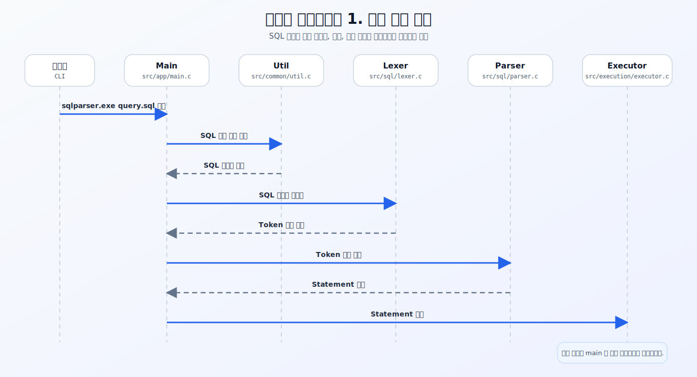
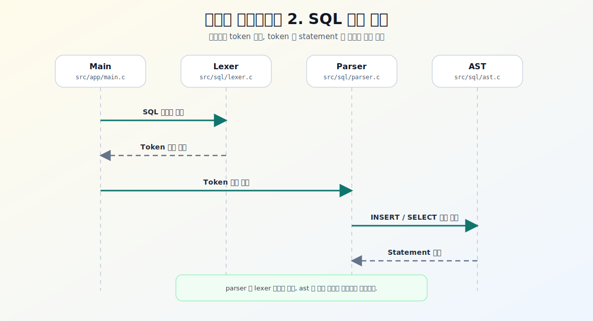
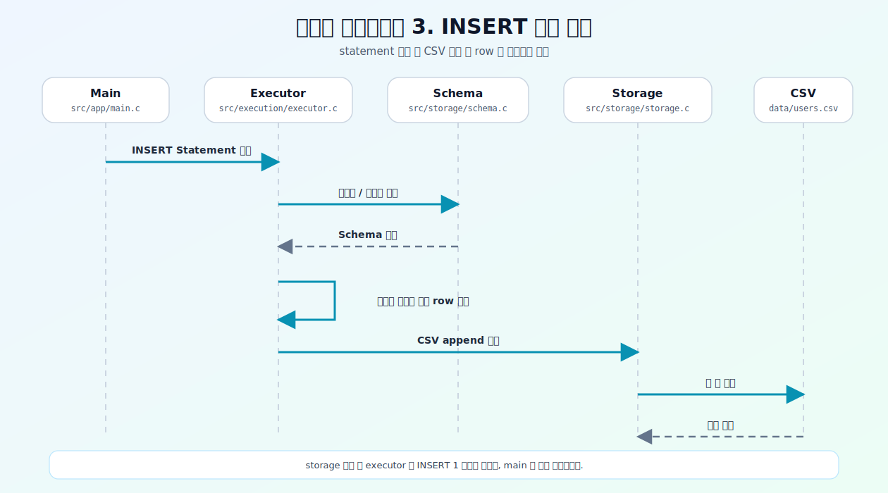
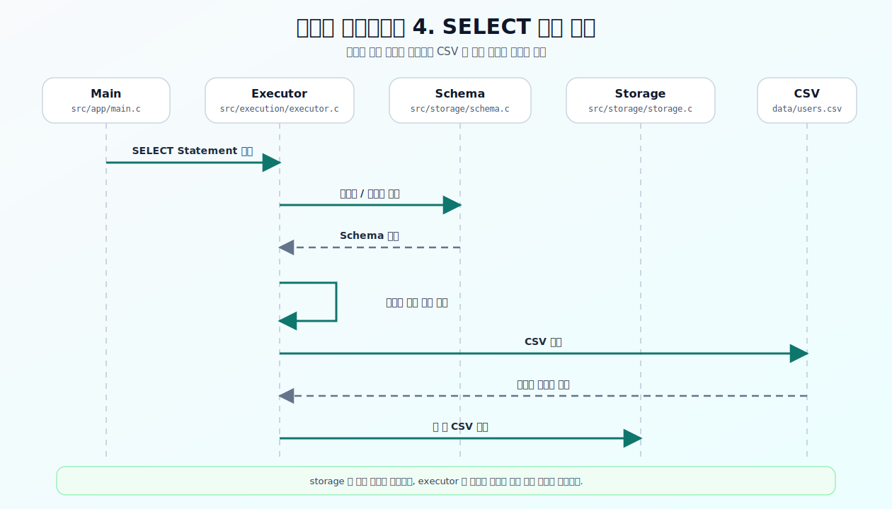
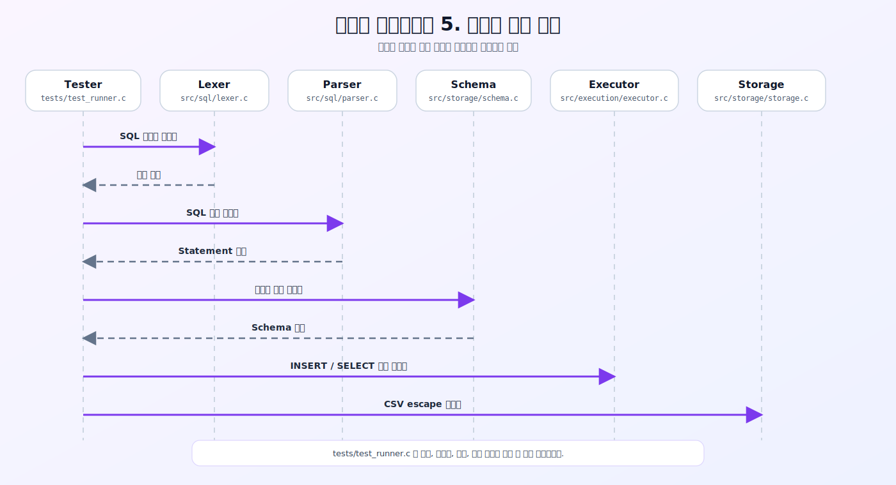

# SqlParser 발표용 README

## 1. 프로젝트 한 줄 소개

SqlParser는 C로 만든 SQL 처리기입니다.  
`INSERT`와 `SELECT` 문장을 해석해서 `schema/`와 `data/` 폴더의 메타 파일, CSV 파일을 기준으로 동작합니다.

## 2. 왜 만들었는가

- SQL이 실제로 어떻게 해석되고 실행되는지 직접 구현해보기 위해 만들었습니다.
- 데이터베이스 엔진 전체를 구현하기보다, SQL이 입력되고 실행되기까지의 흐름을 끝까지 경험하는 것에 집중했습니다.
- `입력 -> lexer -> parser -> executor -> storage` 흐름을 코드로 분리해 구현했습니다.

## 3. 핵심 기능

- SQL 파일 입력 실행
- SQL 문자열 직접 입력 실행
- `INSERT INTO ... VALUES ...`
- `SELECT * FROM ...`
- `SELECT col1, col2 FROM ...`
- schema 메타 정보 검증
- CSV 기반 저장 및 조회
- 테스트 코드 기반 동작 검증

## 4. 실행 흐름

```text
사용자 입력
  -> Lexer
  -> Parser
  -> Executor
  -> Schema / Storage
  -> 결과 출력
```

- Lexer: SQL 문자열을 토큰으로 분리합니다.
- Parser: 토큰을 읽어 `INSERT`, `SELECT` 구조로 해석합니다.
- Executor: 해석 결과를 실제 파일 작업으로 연결합니다.
- Schema/Storage: CSV와 메타 파일을 읽고 검증합니다.

## 5. 조각으로 나눈 시퀀스 다이어그램

### 전체 실행 흐름



### SQL 파싱 흐름



### INSERT 실행 흐름



### SELECT 실행 흐름



### 테스트 실행 흐름



## 6. 발표 시연 포인트

### 빌드

```powershell
gcc -Wall -Wextra -std=c11 -Iinclude -o build/bin/sqlparser.exe src/app/main.c src/common/util.c src/storage/schema.c src/storage/storage.c src/sql/ast.c src/sql/lexer.c src/sql/parser.c src/execution/executor.c
```

### 실행 예시

```powershell
.\build\bin\sqlparser.exe .\examples\select_all_users.sql
.\build\bin\sqlparser.exe "SELECT * FROM student;"
./build/bin/sqlparser "INSERT INTO student (id, department, student_number, name, age) VALUES (4, '컴퓨터공학', 2026004, '임재환', 20);"

```

## 7. 브랜치별 작업 내용

이번 프로젝트는 기능을 단계별 브랜치로 나누고, 이후 `main`으로 통합하는 방식으로 진행했습니다.

- `step/01-foundation`
  CLI 진입점과 SQL 파일 로더를 만들고 프로젝트의 기본 실행 골격을 구성했습니다.
- `step/02-schema-storage`
  스키마 메타 파일 규칙과 CSV 저장 구조를 정의하고, 파일 검증 로직을 추가했습니다.
- `step/03-parser`
  `INSERT`, `SELECT` 문장을 해석할 수 있는 parser 흐름을 구현했습니다.
- `step/04-execution`
  해석된 SQL을 실제 CSV 읽기/쓰기 동작으로 연결했습니다.
- `step/05-quality`
  parser, execution, schema, CSV escape를 검증하는 테스트를 추가했습니다.
- `step/06-readme-demo`
  README, 다이어그램, 데모 문서 등 발표와 온보딩용 자료를 정리했습니다.
- `codex/main-direct-sql`
  SQL 파일 경로뿐 아니라 SQL 문자열 자체를 바로 입력해 실행할 수 있도록 CLI를 확장했습니다.
- `codex/direct-sql-cli-input`
  직접 SQL 입력 기능을 별도 실험 브랜치에서 검증하고 개선했습니다.
- `codex/student-table-sample`
  학생 예제 테이블, 한글 식별자, 영문 파일명 alias 처리까지 포함한 샘플 데이터를 추가했습니다.
- `main`
  각 단계의 기능을 통합하고 문서, 예제, 샘플 데이터까지 정리한 최종 브랜치입니다.

## 8. 이번 작업에서 강조할 점

- 작은 SQL 엔진이지만 입력부터 실행까지 전체 파이프라인이 이어집니다.
- 단순 문법 해석에 그치지 않고 실제 파일 기반 저장과 조회까지 수행합니다.
- 기능 구현과 문서 작업을 브랜치 단위로 분리해 협업 흐름을 명확하게 유지했습니다.

## 9. AI 회고

### AI를 어떻게 활용했는가

- AI로 기획서 초안을 만든 뒤, 팀 전체가 검토하며 프로젝트를 진행했습니다.
- 프로젝트를 기능별로 단계를 나눈 후, 각 단계를 브랜치로 분리해 진행했습니다.
- 단계마다 학습 시간을 정해 코드를 분석한 뒤, 이해한 내용을 팀원들과 공유했습니다.
- 공유한 내용을 서로 검증한 후 다음 단계로 넘어가는 방식으로 진행했습니다.

### AI를 쓰며 좋았던 점

- 구현 내용을 문서화할 때 시간을 크게 줄일 수 있었습니다.
- 전체 코드를 한 번에 보지 않고, 단계별로 나누어 학습할 수 있어 학습 효율이 높아졌습니다.

### 아쉬웠던 점과 배운 점

- AI가 항상 현재 코드 상태를 정확히 이해하는 것은 아니어서, 최종 확인은 사람이 직접 해야 했습니다.
- 단축키 동작이나 개발환경 문제처럼 도구 의존적인 이슈는 코드 수정만으로 해결되지 않는 경우가 있었습니다.
- 그래서 AI는 초안 작성과 속도 향상에는 강하지만, 최종 검증과 맥락 판단은 팀이 직접 맡아야 한다는 점을 배웠습니다.
